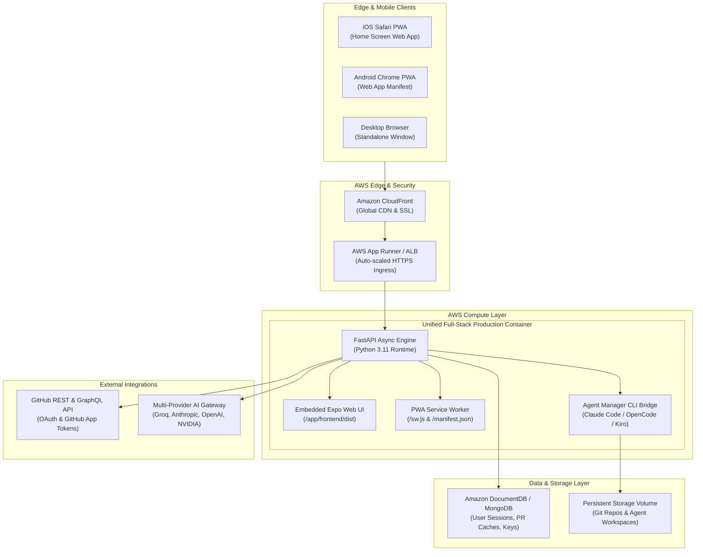

# MergeDeck: Reels for Pull Requests — Supervising Autonomous Coding Agents at Scale on AWS

### Description
> Autonomous coding agents are now opening over 1.2 million pull requests every month, but human engineers remain bottlenecked by flat, grey walls of diff text on desktop screens. **MergeDeck** (formerly *Snippets*) introduces a paradigm shift: a mobile-first, reel-style review interface that turns code supervision into a high-throughput, swipeable card deck. By combining agent trajectory tracing (What → Why → How), bi-directional background agent orchestration, inline multi-model AI chat, and a full-featured Progressive Web App (PWA) running on AWS App Runner, MergeDeck transforms software engineers from line-by-line typists into directors of autonomous agent swarms.

---

## 1. The Industry Crisis: The Code Review Bottleneck in the Agentic Era

Over the past year, software engineering has reached a tipping point. For four decades, the primary constraint on shipping software was the speed at which humans could type and test code. 

Today, that constraint has flipped.

Autonomous coding agents—powered by frontier reasoning models like Claude 3.7 Sonnet, OpenAI o1/o3-mini, DeepSeek-R1, and agentic CLI orchestrators such as **Claude Code**, **Kiro**, and **OpenCode**—can author entire features, refactor codebases, and patch vulnerabilities in seconds. Coding agents are now opening more than **1.2 million pull requests every month**, a volume expanding at **14× year-over-year**.

Yet, while code generation has become exponential, the code review experience has remained fundamentally unchanged since 2008:

* **Flat, Grey Walls of Text**: Reviewers are confronted with massive, uncontextualized diffs with zero indication of why specific architectural tradeoffs were made.
* **Erased Agent Trajectory**: Agents execute deep research, trial executions, tool invocations, and test suites before submitting a PR. Yet on standard git web interfaces, that entire cognitive trajectory is discarded—flattened into raw git diff hunks.
* **Desktop Tethering**: Standard git platforms require a desktop workstation to evaluate checks, inspect diffs, and approve code. A developer away from their desk cannot comfortably triage incoming PRs on a mobile phone.
* **Supervision Collapse**: Software engineers have become the latency bottleneck in their own development cycles, struggling to keep pace with tireless agent workflows.

Here was the foundational vision behind the project:

> **The Original Thesis:**
>
> *"Agents are writing code at scale.*
> *Claude Code, Codex, Gemini, Kiro, OpenCode — they're opening PRs autonomously, 1.2M+ a month and growing 14x.*
>
> *But we're still reviewing that code on GitHub's flat, grey walls of text. No context. No reasoning. No trajectory. Just a massive diff and a merge button.*
> *Snippets fixes that.*
>
> *It's an AI-native PR review interface built for the agentic era — swipeable PR feed, agent trajectory (what → why → how), inline AI chat, one-tap approve/reject/merge, and the ability to FIRE new background agents directly from the review interface and bring them back into a structured human loop.*
> *Agents ship code. Humans need better surfaces to supervise them at scale. That's Snippets."*

That original prototype has now evolved into **MergeDeck**.

---

## 2. What We Innovated: The "Reel-Style" PR Interface

MergeDeck re-imagines code review by combining the cognitive ease and high throughput of **short-form vertical reels/shorts** with deep agent telemetry and multi-model AI supervision.

Instead of scrolling through hundreds of lines across dozens of files on a wide desktop display, MergeDeck presents pull requests as a **deck of swipeable, self-contained reel cards**:

```
 ┌─────────────────────────────────────────────────────────────┐
 │                     MERGEDECK REEL FEED                     │
 │                                                             │
 │   [ BUG FIX ]     [ RISK: LOW ]     [ +34 / -12 lines ]     │
 │                                                             │
 │   fix/menubar-interval-leak                                 │
 │   repo: replay-web · PR #142                                │
 │                                                             │
 │   ┌─────────────────────────────────────────────────────┐   │
 │   │  FOCUSED MICRO-DIFF WITH SYNTAX HIGHLIGHTING        │   │
 │   │  - setInterval(poll, 1000);                         │   │
 │   │  + const timerId = setInterval(poll, 1000);         │   │
 │   │  + return () => clearInterval(timerId);             │   │
 │   └─────────────────────────────────────────────────────┘   │
 │                                                             │
 │   ┌─────────────────────────────────────────────────────┐   │
 │   │  AGENT TRAJECTORY: What → Why → How                 │   │
 │   │  1. What: Resolved unmounted memory leak in Menubar │   │
 │   │  2. Why: setInterval persisted across route changes │   │
 │   │  3. How: Added cleanup hook & passed 4 unit tests   │   │
 │   └─────────────────────────────────────────────────────┘   │
 │                                                             │
 │   [ 💬 AI Chat ]     [ ⚡ Fire Agent ]     [ ✓ One-Tap Merge ]│
 └─────────────────────────────────────────────────────────────┘
```

### Core Innovations in MergeDeck

#### 1. Vertical Reel Card Deck
* Each card acts as an executive summary of the pull request.
* **Risk Score & Semantic Badges**: Instant visual indicators classifying changes as *Bug Fix*, *Security*, *Refactor*, *Feature*, or *Performance*.
* **Micro-Diff Viewer**: Highlights only the high-impact code changes with full syntax highlighting, avoiding the noise of auto-generated files and lockfile updates.

#### 2. Agent Trajectory Engine (What → Why → How)
Instead of forcing engineers to reverse-engineer why code was written a certain way, MergeDeck extracts and structures the agent’s execution narrative:
* **What**: The core objective and business intent.
* **Why**: The architectural rationale, alternatives considered, and edge cases handled.
* **How**: The step-by-step tool trace, commands executed, dependencies added, and verification tests run.

#### 3. Bi-Directional Agent Orchestration ("Fire New Agents")
Traditional review interfaces are passive: you write a comment, request changes, and wait. MergeDeck turns code review into an **active command center**. 

Right from the review card, an engineer can tap **"Assign Agent"** to launch a background agent—such as **Claude Code**, **OpenCode**, or **Kiro**—with specific feedback:
> *"Refactor this database query to use DynamoDB batch gets, and add integration test coverage for null IDs."*

The background agent checks out the branch, implements the modifications, runs tests, and pushes back to GitHub—instantly updating your MergeDeck feed with a new trajectory card ready for final approval.

#### 4. Inline Contextual AI Reviewer (`AIChatSheet`)
A slide-up drawer provides real-time AI conversation on any specific PR or file diff:
* Ask questions: *"Could this cause a race condition under high load?"*
* Explain obscure logic: *"Walk me through the regex on line 58."*
* Powered by a **BYOK (Bring Your Own Key)** multi-provider engine supporting **Groq** (sub-second LPU inference), **Anthropic Claude**, **OpenAI**, **Mistral**, **NVIDIA NIM**, and **OpenRouter**.

#### 5. Mobile-First Progressive Web App (PWA)
MergeDeck was designed from day one to untether developers from desktop workstations:
* **Installable on iOS & Android**: Runs in full-screen standalone mode with no browser URL bars or navigation chrome.
* **Service Worker Caching & Offline Mode**: Pre-caches the app shell and core assets. If you lose connection in transit, a dedicated dark-mode offline screen buffers your state and automatically reconnects when network returns.
* **Custom Brand Identity**: Dynamic cyan and electric purple neon favicons and adaptive app icons.

---

## 3. Cloud-Native Architecture on AWS

MergeDeck is architected as a lightweight, high-performance containerized system designed for zero-friction deployment on AWS.

### Architecture Diagram



### Why AWS App Runner & ECS Fargate are Ideal

1. **Zero-Configuration Container Hosting**:
   MergeDeck bundles the pre-compiled Expo Web frontend and the async Python FastAPI backend into a single multi-stage OCI container image. AWS App Runner connects directly to the repository (or Amazon ECR), manages SSL termination, and automatically scales container instances up or down based on incoming request load.
2. **Containerized CLI Agent Sandboxing**:
   The runtime container bundles Node.js, Python, and CLI tools, providing a secure, isolated sandbox where agent CLI tools execute repository modifications without risk to the host system.
3. **Low-Latency Edge Delivery**:
   Pairing the deployment with **Amazon CloudFront** ensures that static PWA assets (`/_expo/`, `/assets/`, `/icons/`) are cached globally at Edge locations, yielding sub-300ms time-to-interactive on mobile devices worldwide.

---

## 4. Deep Dive: Key Technical Highlights

### 1. Unified Multi-Stage Production Build
MergeDeck solves the deployment complexity of separate frontend and backend services by compiling both into a self-contained container:
```dockerfile
# Stage 1: Build Expo Web Frontend
FROM node:20-alpine AS frontend-builder
WORKDIR /app/frontend
COPY frontend/package.json ./
RUN npm install --legacy-peer-deps
COPY frontend/ ./
RUN npx expo export --platform web

# Stage 2: Production Python Backend + Runtime
FROM python:3.11-slim AS runner
WORKDIR /app
RUN apt-get update && apt-get install -y curl git build-essential \
    && curl -fsSL https://deb.nodesource.com/setup_20.x | bash - \
    && apt-get install -y nodejs
COPY backend/requirements.txt ./backend/
RUN pip install --no-cache-dir -r backend/requirements.txt
COPY backend/ ./backend/
COPY --from=frontend-builder /app/frontend/dist ./frontend/dist
ENV PORT=8000
CMD ["python", "main.py"]
```

### 2. Dual GitHub Authentication (OAuth + GitHub App)
MergeDeck accommodates both personal and enterprise repositories seamlessly:
* **Personal Repositories**: Authenticated via standard GitHub OAuth for fast user onboarding.
* **Organization & Enterprise Repositories**: Authenticated via GitHub App installation tokens (JWT-minted RS256 with 1-hour expiration) to ensure granular permissions and enterprise compliance.

### 3. PWA Header Delivery
Modern browser PWA standards require exact MIME types and caching headers. In FastAPI, dedicated routes ensure strict adherence:
```python
@app.get("/sw.js")
async def serve_service_worker():
    return FileResponse(
        frontend_dist / "sw.js",
        media_type="application/javascript",
        headers={
            "Service-Worker-Allowed": "/",
            "Cache-Control": "no-cache, no-store, must-revalidate",
        },
    )

@app.get("/manifest.json")
async def serve_manifest():
    return FileResponse(
        frontend_dist / "manifest.json",
        media_type="application/manifest+json",
        headers={"Cache-Control": "public, max-age=3600"},
    )
```

---

## 5. Deploying MergeDeck on AWS

Deploying MergeDeck to AWS App Runner takes under 3 minutes:

### 1. Clone the Codebase
```bash
git clone https://github.com/CodeNova-Ayush/AWS-Project.git
cd AWS-Project
```

### 2. Set Up Environment Variables
Configure your database connection and GitHub OAuth application credentials in `.env`:
```env
MONGO_URL=mongodb://mongo:27017/codetok
DB_NAME=codetok
PORT=8000
GITHUB_OAUTH_CLIENT_ID=your_client_id
GITHUB_OAUTH_CLIENT_SECRET=your_client_secret
GITHUB_REDIRECT_URI=https://your-domain.com/auth-callback
```

### 3. Deploy via AWS App Runner
Using the repository's `apprunner.yaml`:
```bash
aws apprunner create-service \
  --service-name mergedeck \
  --source-configuration '{
    "AuthenticationConfiguration": { "ConnectionArn": "arn:aws:apprunner:..." },
    "CodeRepository": {
      "RepositoryUrl": "https://github.com/CodeNova-Ayush/AWS-Project",
      "SourceCodeVersion": { "Type": "BRANCH", "Value": "main" },
      "CodeConfiguration": { "ConfigurationSource": "REPOSITORY" }
    }
  }'
```

App Runner builds the container, binds to `$PORT`, runs health checks on `/health`, and provisions a live HTTPS domain.

---

## 6. The Future of Human-Agent Software Engineering

The software engineering profession is undergoing a fundamental transformation. Developers are transitioning from **line-by-line typists** into **orchestrators of autonomous agent swarms**. 

In this new paradigm, developer throughput is no longer governed by how many lines of code you can write per day. It is governed by how rapidly, accurately, and safely you can review, steer, and approve changes produced by AI agents.

MergeDeck is the control surface designed for this era:
* **Swipe** through pull requests in seconds with high cognitive clarity.
* **Inspect** the reasoning trajectory rather than getting lost in raw diffs.
* **Command** background agents to fix code and loop back into the review flow.
* **Supervise** your engineering pipeline anywhere, anytime, right from your phone.

---

### Resources
* **GitHub Repository**: [https://github.com/CodeNova-Ayush/AWS-Project](https://github.com/CodeNova-Ayush/AWS-Project)
* **Container Guide**: [DOCKER.md](file:///Users/karanram/Documents/AWS-Project/DOCKER.md)
* **AWS App Runner Configuration**: [apprunner.yaml](file:///Users/karanram/Documents/AWS-Project/apprunner.yaml)
