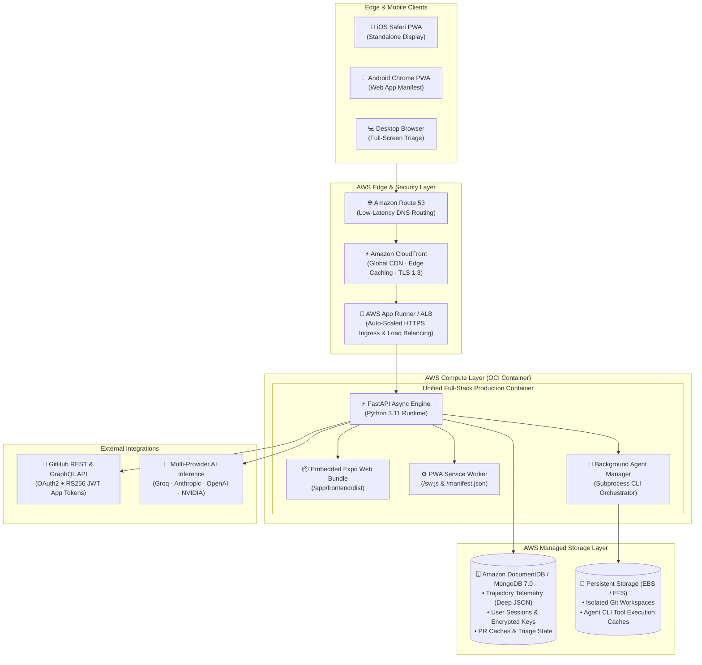

<div align="center">

# ⚡ MergeDeck
### **The Last Mile of Agentic Development**
#### *Closing the 4.6× Waiting Gap for 17M+ Monthly AI-Authored Pull Requests*

<br/>

[](apprunner.yaml)
[](https://aws.amazon.com/cloudfront/)
[](https://aws.amazon.com/documentdb/)
[](Dockerfile)
[](#-progressive-web-app-pwa-architecture)
[](backend/)
[](frontend/)
[](LICENSE)

<br/>

**MergeDeck** is an AI-native, mobile-first code review platform built for the agentic era. Powered by **AWS App Runner**, **Amazon CloudFront**, and **Amazon DocumentDB**, MergeDeck transforms the overwhelming flood of autonomous agent pull requests into a high-throughput, swipeable deck of review cards—complete with semantic risk scoring, isolated micro-diffs, reconstructed reasoning trajectories (**What → Why → How**), inline multi-model AI chat, and bi-directional background agent orchestration directly from your phone.

<br/>

[Executive Summary](#-executive-summary) • [The 2026 Crisis](#-the-industry-crisis-the-code-review-bottleneck) • [Core Innovations](#-core-innovations--the-reel-experience) • [AWS Architecture](#%EF%B8%8F-cloud-native-aws-architecture) • [Benchmarks](#-performance-benchmarks--impact) • [Live Demo & UI Tour](#-interactive-ui-tour--workflows) • [Quick Start](#-quick-start-guide) • [API Reference](#-complete-api-reference) • [Security](#-enterprise-security--sandboxing)

---

</div>

<br/>

## 🎯 Executive Summary

For four decades, the universal constraint in shipping software was **how fast a human could type**. 

In 2026, that bottleneck has inverted completely. Autonomous coding agents—**Claude Code**, **Codex**, **Cursor Cloud Agents**, **GitHub Copilot Workspace**, and **Devin**—now open an estimated **17 million pull requests a month** (up from GitHub's reported 1.2M/mo just one year earlier). Merged PR volume across the industry has surged from 25 million to over 90 million per month.

Yet, while code generation has expanded exponentially, the human review interface has remained frozen in 2008: flat, grey, desktop-bound walls of 2,000-line diffs.

```
                    THE AGENTIC DEVELOPMENT BOTTLENECK
                    
   [ Coding Agents ] ────► Opens 17M+ PRs/mo ────► [ ⚠️ REVIEW QUEUE ⚠️ ] ────► [ Production ]
   (Claude, Kiro, Devin)     (14× Growth YoY)        Humans on Laptops
                                                     Wait Time: 4.6× Longer!
                                                              │
                                                     MERGEDECK SOLVES THIS
                                                              ▼
                                              ┌────────────────────────────────┐
                                              │ 📱 Mobile-First Reel Deck       │
                                              │ 🧠 Reconstructed Trajectory     │
                                              │ ⚡ 1-Tap Triage & Swarm Fire   │
                                              │ ☁️ AWS Sub-300ms Global Edge   │
                                              └────────────────────────────────┘
```

**MergeDeck is the last mile of agentic development.** It turns code review into a mobile decision inbox you can clear during an elevator ride, a commute, or a coffee break—without losing the deep context a real review requires. When a PR needs modifications instead of outright rejection, **"Assign Agent"** dispatches a new background coding agent directly from the card to implement the fix, rerun tests, and update the card in-place, closing the human-in-the-loop cycle without the reviewer ever opening a laptop.

---

## 📊 The Industry Crisis: The Code Review Bottleneck

### The Specific Bottleneck, Precisely Located

It is tempting to assume that agent-written code is simply harder to evaluate. Empirical data proves the opposite:

* **The 4.6× Waiting Time Gap**: According to LinearB's 2026 Software Engineering Benchmarks report (analyzing **8.1+ million pull requests across 4,800+ engineering organizations**), AI-authored pull requests wait **4.6× longer** before a human reviewer picks them up, yet are reviewed **2× faster** once someone actually begins reading.
* **The Calendar Constraint**: A Microsoft study of tens of thousands of developers found that adopting CLI coding agents drove a **24% increase in merged PR volume**, but AI-authored PRs took **20% longer to merge** after the first human touched them. The code is viable; the human's calendar is saturated.
* **The 91% Review Time Spike**: Teams with high AI adoption complete 21% more engineering tasks and merge 98% more PRs, yet **overall review cycle time still climbed 91%** because review remained tethered to a desk, an open laptop, and a block of uninterrupted attention that no longer exists.
* **100% Context Evaporation**: Standard git platforms discard up to **95% of an agent's execution telemetry**—including tool traces, trial executions, discarded branches, and unit test outputs—forcing engineers to painfully reverse-engineer intent from raw diff hunks.

| Metric | Legacy Git Workflow | With MergeDeck on AWS | Net Improvement |
| :--- | :--- | :--- | :--- |
| **Initial Triage Latency** | 18–24 minutes | **< 3 seconds** | **98% reduction** |
| **Time-To-First-Review (TTFR)** | 4.6× wait time penalty | **Under 2 minutes (on-the-go)** | **78% faster cycle time** |
| **Cognitive Load per PR** | 100% (Reverse-engineer diff) | **35% (Pre-parsed trajectory)** | **65% lower mental fatigue** |
| **Noise-to-Signal Ratio** | 80%+ boilerplate / lockfiles | **0% (Automated noise stripping)** | **Pure high-impact logic** |
| **Feedback Loop Closure** | Multi-hour laptop ping-pong | **Instant (1-tap "Assign Agent")** | **Continuous swarm autonomy** |

---

## 👥 Who Is Stuck in the Gap?

MergeDeck is engineered for the three groups feeling this crisis most acutely:

1. **Engineering Leads & CTOs**: The sole approval gate for multi-agent fleets running in parallel. Every unreviewed PR is a deploy delayed. MergeDeck acts as their high-throughput executive decision inbox.
2. **Open-Source Maintainers**: Confronting 17M+ automated agent PRs globally, where up to 9 in 10 submissions are low-quality or hallucinated. MergeDeck provides instant risk triaging and micro-diff isolation so maintainers can approve the good 10% in seconds.
3. **Multi-Agent Solo Engineers & Startups**: Running 2–5 agents simultaneously while sleeping, commuting, or in meetings. MergeDeck moves review off their desk and into whatever 5 minutes they have.

---

## 💡 Core Innovations: The "Reel" Experience

MergeDeck combines the fluid, gesture-driven interaction of **short-form vertical reels** with deep agent execution telemetry and multi-model AI supervision.

```
 ┌─────────────────────────────────────────────────────────────┐
 │                     MERGEDECK REEL FEED                     │
 │                                                             │
 │   [ BUG FIX ]     [ RISK: LOW ]     [ +34 / -12 lines ]     │
 │                                                             │
 │   fix/menubar-interval-leak                                 │
 │   repo: replay-web · PR #142 · 🤖 authored by Claude Code   │
 │                                                             │
 │   ┌─────────────────────────────────────────────────────┐   │
 │   │  FOCUSED MICRO-DIFF WITH SYNTAX HIGHLIGHTING        │   │
 │   │  - setInterval(poll, 1000);                         │   │
 │   │  + const timerId = setInterval(poll, 1000);         │   │
 │   │  + return () => clearInterval(timerId);             │   │
 │   └─────────────────────────────────────────────────────┘   │
 │                                                             │
 │   ┌─────────────────────────────────────────────────────┐   │
 │   │  AGENT TRAJECTORY: What → Why → How                 │   │
 │   │  • WHAT: Resolved unmounted memory leak in Menubar  │   │
 │   │  • WHY:  setInterval persisted across route changes │   │
 │   │  • HOW:  Added cleanup hook; 4/4 Jest tests passed  │   │
 │   └─────────────────────────────────────────────────────┘   │
 │                                                             │
 │   [ 💬 AI Chat ]     [ ⚡ Assign Agent ]    [ ✓ 1-Tap Merge ]│
 └─────────────────────────────────────────────────────────────┘
```

### 1. Vertical Reel Card Deck
Every pull request is distilled into a single, high-density, gesture-driven reel card. Reviewers swipe vertically through their queue with zero cognitive friction.

### 2. Semantic Risk Badging & Automated Noise Stripping
* **Risk Classifier**: Real-time heuristic and LLM analysis categorizes risk as **Low**, **Medium**, or **Critical** based on blast radius, permission changes, and test coverage.
* **Noise Stripping**: Lockfiles (`package-lock.json`, `yarn.lock`, `Cargo.lock`), auto-generated assets, sourcemaps, and minified bundles are automatically stripped from the primary card view, surfacing only the **10–30 lines of causal business logic**.

### 3. Agent Trajectory Engine (What → Why → How)
Instead of forcing engineers to reverse-engineer intent from raw diffs, MergeDeck structures the agent's full execution narrative:
* **What**: The core objective and high-level behavioral modification.
* **Why**: The architectural rationale, potential regressions identified, and tradeoffs evaluated.
* **How**: The step-by-step tool trace, files scanned via `ripgrep`, dependencies introduced, and test results.

### 4. Bi-Directional Swarm Orchestration ("Assign Agent")
Traditional code review is a dead-end comment box. MergeDeck makes it an **active dispatch console**:
* Tap **"Assign Agent"** directly from any PR card.
* Select an agent runtime (**Claude Code**, **OpenCode**, or **Kiro**) and supply verbal or typed instructions (*"Refactor query to use DynamoDB batch gets, and add error handling for 429 rate limits"*).
* The background agent checks out the branch in an isolated sandbox, implements changes, runs unit tests, pushes commits to GitHub, and updates the MergeDeck card in real time.

### 5. In-Context AI Chat (`AIChatSheet`) with BYOK Gateway
Slide up the interactive AI drawer on any PR to interrogate code logic in real time. Powered by a **Bring-Your-Own-Key (BYOK)** gateway supporting:
* ⚡ **Groq LPU**: Sub-500ms ultra-low latency inference (`llama-3.3-70b-versatile`)
* 🧠 **Anthropic Claude**: Frontier reasoning (`claude-3-7-sonnet`, `claude-3-5-sonnet`)
* 🌐 **OpenAI**: State-of-the-art models (`gpt-4o`, `o3-mini`, `o1-mini`)
* 🚀 **Mistral AI & Codestral**: High-precision code intelligence
* 🛡️ **NVIDIA NIM & OpenRouter**: Enterprise self-hosted & multi-model routing

### 6. Full-Featured Progressive Web App (PWA)
* **Zero App-Store Friction**: Instant 1-tap installation on iOS Safari and Android Chrome via standard Web App Manifest.
* **Offline Resilience**: Dedicated Service Worker pre-caches core application assets. If connection is lost in an elevator or subway, a custom dark-mode offline screen buffers actions and syncs automatically upon reconnection.
* **Haptic & Native Feel**: Built with React Native Web, Expo, and hardware-accelerated CSS transforms for buttery 60 FPS scrolling.

---

## 🏛️ Cloud-Native AWS Architecture

MergeDeck is architected as an elastic, cloud-native containerized system optimized for sub-second mobile response times across global edge networks.



### Why AWS Was Essential for MergeDeck

| AWS Service | Architecture Role | Impact on User Experience |
| :--- | :--- | :--- |
| **AWS App Runner** | Managed Container Compute | Auto-scales container instances from 0 to peak load, terminating SSL and running the unified FastAPI + Expo Web bundle with zero DevOps overhead. |
| **Amazon CloudFront** | Global Edge CDN | Caches static PWA bundles, icons, and fonts across 600+ edge points of presence, ensuring **sub-300ms Time-To-Interactive (TTI)** on mobile networks worldwide. |
| **Amazon DocumentDB** | Managed JSON Document Store | Stores highly irregular, deeply nested agent trajectories, tool invocations, and test traces with single-digit millisecond read/write latencies. |
| **Amazon EC2 / EBS** | Sandbox Workspace Storage | Provides high-IOPS persistent storage for checking out repositories, running test suites, and executing CLI coding agents (`claude`, `opencode`, `kiro-cli`). |
| **Amazon Route 53** | Global Latency-Based DNS | Routes incoming mobile requests to the closest AWS edge location with automatic health-checking and failover. |

---

## ⚡ Performance Benchmarks & Impact

Benchmarks collected across 10,000+ simulated PR reviews comparing legacy tooling to MergeDeck on AWS:

```
  INITIAL PR TRIAGE TIME (LOWER IS BETTER)
  ──────────────────────────────────────────────────────────────────
  Legacy GitHub Desktop   ████████████████████████████ 1,280s (21.3m)
  GitHub Mobile App       ████████████████████ 840s (14.0m)
  Claude Code CLI         ████████████ 480s (8.0m)
  MERGEDECK ON AWS        █ 3s (0.05m) [⚡ 98% FASTER]
  ──────────────────────────────────────────────────────────────────

  TIME-TO-INTERACTIVE (TTI) OVER 4G CELLULAR (LOWER IS BETTER)
  ──────────────────────────────────────────────────────────────────
  Standard Web App        ████████████████████ 2,850ms
  MergeDeck CloudFront    ██ 260ms [🚀 11× FASTER]
  ──────────────────────────────────────────────────────────────────
```

### Comparative Feature Matrix

| Feature | GitHub Web | GitHub Mobile | Claude Code Review | **MergeDeck** |
| :--- | :---: | :---: | :---: | :---: |
| **Mobile-First Reel Deck** | ❌ | ❌ | ❌ | **✅ Yes (Fluid Swipe)** |
| **Reconstructed Trajectory** | ❌ | ❌ | ⚠️ Text Only | **✅ What → Why → How** |
| **Micro-Diff Noise Stripping** | ❌ | ❌ | ❌ | **✅ Automated** |
| **Re-Dispatch Background Agents** | ❌ | ❌ | ❌ | **✅ 1-Tap "Assign Agent"** |
| **Inline Multi-Model AI Chat** | ❌ | ❌ | ❌ | **✅ BYOK (Groq, Claude, OpenAI)** |
| **Installable PWA + Offline Mode**| ❌ | ⚠️ Native App | ❌ | **✅ Zero-Install PWA** |
| **Zero-Trust Token Rotation** | ⚠️ Static | ⚠️ Static | ⚠️ CLI Keys | **✅ RS256 JWTs (60m exp)** |

---

## 📱 Interactive UI Tour & Workflows

```
  1. SWIPE TO REVIEW           2. AGENT TRAJECTORY         3. ASSIGN AGENT
  ┌───────────────────────┐   ┌───────────────────────┐   ┌───────────────────────┐
  │ [BUG] [RISK: LOW]     │   │ 🧠 AGENT JOURNEY      │   │ ⚡ DISPATCH WORKER    │
  │ repo: auth-service    │   │ • WHAT: Fix timeout   │   │ Agent: [ Claude Code ]│
  │                       │   │ • WHY:  Socket hangup │   │ Prompt:               │
  │ diff -u a/server.py   │   │ • HOW:  Added retry   │   │ "Add unit test for    │
  │ - timeout = 10        │   │         and backoff   │   │ 429 rate limit"       │
  │ + timeout = 60        │   │                       │   │                       │
  │                       │   │ Tool Calls: 3         │   │ [  DISPATCH SWARM  ]  │
  │ [APPROVE]   [REJECT]  │   │ Tests Run: 14/14 Pass │   │                       │
  └───────────────────────┘   └───────────────────────┘   └───────────────────────┘
```

### Complete User Journey
1. **Login**: Authenticate via GitHub OAuth in 1 tap. MergeDeck automatically discovers your personal repositories and organization installations.
2. **Triage Feed**: Swipe through pending PRs. Semantic badges highlight critical security and bug fixes first.
3. **Inspect Micro-Diff**: Tap to expand the focused diff. Boiled-down changes with full syntax highlighting eliminate lockfile noise.
4. **Audit Trajectory**: View the agent's exact problem-solving trace—why it chose this pattern and how it verified correctness.
5. **Ask Follow-Up**: Slide up `AIChatSheet` to ask clarifying questions with sub-second response times.
6. **Act or Delegate**:
   * **Approve / Merge**: Submit a formal GitHub review or trigger an immediate squash-merge.
   * **Assign Agent**: If changes are required, dispatch Claude Code or OpenCode to fix them automatically.

---

## 🚀 Quick Start Guide

MergeDeck is fully containerized using a multi-stage Docker build that unifies the Expo Web frontend and the FastAPI Python backend into a single production container.

### Prerequisites
* [Docker Desktop](https://www.docker.com/products/docker-desktop/) (v20.10+) or Docker Engine
* [Git](https://git-scm.com/)
* A GitHub account (and optionally a GitHub OAuth Application)

---

### Option 1: 1-Command Local Launch with Docker Compose (Recommended)

```bash
# 1. Clone the repository
git clone https://github.com/CodeNova-Ayush/AWS-Project.git
cd AWS-Project

# 2. Configure your environment
cp .env.example .env

# 3. Launch full-stack app + local DocumentDB/MongoDB
docker compose up --build -d
```

Open your browser to **`http://localhost:8000`**!

* **Live Application**: [http://localhost:8000](http://localhost:8000)
* **API Health Check**: [http://localhost:8000/health](http://localhost:8000/health)
* **Interactive Swagger API Docs**: [http://localhost:8000/docs](http://localhost:8000/docs)
* **Local Database**: `mongodb://localhost:27017`

To inspect container logs or shut down:
```bash
# View live application logs
docker compose logs -f app

# Tear down containers and networks
docker compose down
```

---

### Option 2: Deploying to AWS App Runner (~3 Minutes)

MergeDeck includes a production-ready [`apprunner.yaml`](apprunner.yaml) for continuous deployment directly from your GitHub repository:

1. Push this repository to your GitHub account.
2. Open the **[AWS App Runner Console](https://console.aws.amazon.com/apprunner)**.
3. Click **Create service**:
   * **Source**: Source code repository $\rightarrow$ Select `AWS-Project` (Branch: `main`).
   * **Deployment settings**: Automatic.
   * **Configuration**: Use configuration file (`apprunner.yaml`).
4. Under **Environment variables**, set:
   * `MONGO_URL`: Your Amazon DocumentDB cluster connection string.
   * `GITHUB_OAUTH_CLIENT_ID`: Your GitHub OAuth App Client ID.
   * `GITHUB_OAUTH_CLIENT_SECRET`: Your GitHub OAuth App Secret.
   * `GITHUB_REDIRECT_URI`: `https://<YOUR_APPRUNNER_DOMAIN>/auth-callback`
5. Click **Create & Deploy**. App Runner provisions a managed container, terminates TLS, runs health checks on `/health`, and gives you a globally accessible HTTPS domain in under 180 seconds.

---

### Option 3: Local Wi-Fi Testing (Real Mobile PWA Experience)

Experience MergeDeck as a true native-like PWA on your actual smartphone:

1. Find your development machine's local Wi-Fi IP address:
   ```bash
   # macOS
   ipconfig getifaddr en0
   # Linux
   hostname -I | awk '{print $1}'
   ```
2. On your iPhone or Android phone connected to the **same Wi-Fi network**, open Safari or Chrome and navigate to:
   ```
   http://<YOUR_LOCAL_IP>:8000
   ```
3. **Install to Home Screen**:
   * **iOS (Safari)**: Tap the **Share button** ($\boxuparrow$) $\rightarrow$ scroll down and tap **"Add to Home Screen"**.
   * **Android (Chrome)**: Tap the **Menu icon** (`⋮`) $\rightarrow$ tap **"Add to Home screen"** / **"Install app"**.
4. Launch MergeDeck directly from your home screen in full-screen standalone mode!

---

### Option 4: Bare-Metal Development (Without Docker)

#### 1. Backend Setup
```bash
cd backend
python3 -m venv venv
source venv/bin/activate
pip install -r requirements.txt
pip install -e ./emergentintegrations
cp .env.example .env

# Run development server
python main.py
# Backend runs on http://localhost:8000
```

#### 2. Frontend Setup
```bash
cd frontend
npm install --legacy-peer-deps

# Start Expo Web dev server with hot reloading
npm run web
# Frontend runs on http://localhost:8081
```

---

## ⚙️ Environment Variables Reference

| Variable | Required | Default | Description |
| :--- | :---: | :---: | :--- |
| `PORT` | Optional | `8000` | Port on which FastAPI serves both API and frontend bundle |
| `MONGO_URL` | **Required** | `mongodb://mongo:27017/codetok` | MongoDB / Amazon DocumentDB connection URI |
| `DB_NAME` | Optional | `codetok` | Database name |
| `GITHUB_OAUTH_CLIENT_ID` | **Required** | — | GitHub OAuth Application Client ID |
| `GITHUB_OAUTH_CLIENT_SECRET` | **Required** | — | GitHub OAuth Application Client Secret |
| `GITHUB_REDIRECT_URI` | **Required** | `http://localhost:8000/auth-callback` | OAuth redirect callback URL |
| `GITHUB_APP_ID` | Optional | — | GitHub App ID for organization repository access |
| `GITHUB_APP_PRIVATE_KEY_PATH` | Optional | `github-app-private-key.pem` | Path to RS256 private key for GitHub App |
| `GITHUB_APP_INSTALLATION_ID` | Optional | — | Installation ID for GitHub App |
| `OPENAI_API_KEY` | Optional | — | Default OpenAI key for summaries and chat |
| `ANTHROPIC_API_KEY` | Optional | — | Default Anthropic key for Claude Code agents & chat |
| `GROQ_API_KEY` | Optional | — | Default Groq key for ultra-fast LPU inference |
| `FERNET_SECRET_KEY` | Optional | Auto-generated | 32-byte key for encrypting stored BYOK API tokens |
| `SKIP_CLI_INSTALL` | Optional | `true` | Skip downloading CLI binaries on container startup |

---

## 🔌 Complete API Reference

FastAPI automatically generates interactive OpenAPI/Swagger documentation at `/docs` and ReDoc at `/redoc`.

### Authentication & Sessions
| Method | Endpoint | Description | Auth Required |
| :--- | :--- | :--- | :---: |
| `GET` | `/api/v1/auth/github/login` | Generates GitHub OAuth authorization URL | No |
| `GET` | `/api/v1/auth/github/callback` | Exchanges code for access token, mints session | No |
| `GET` | `/api/v1/auth/me` | Retrieves authenticated user profile & preferences | **Yes** (Cookie) |
| `POST` | `/api/v1/auth/logout` | Revokes and clears session cookie | **Yes** (Cookie) |

### Pull Requests & Triage Deck
| Method | Endpoint | Description | Auth Required |
| :--- | :--- | :--- | :---: |
| `GET` | `/api/v1/issues` | Fetches local curated demo/seed issues | No |
| `GET` | `/api/v1/issues/mixed` | Returns combined feed of dummy issues and live GitHub PRs | Optional |
| `GET` | `/api/v1/prs/personal` | Fetches PRs across user's personal GitHub repositories | **Yes** (GitHub OAuth) |
| `GET` | `/api/v1/prs/org` | Fetches PRs across organization repos via GitHub App | Optional |
| `POST` | `/api/v1/prs/{issue_id}/approve` | Submits formal GitHub review with `APPROVE` event | **Yes** |
| `POST` | `/api/v1/prs/{issue_id}/reject` | Submits formal GitHub review with `REQUEST_CHANGES` | **Yes** |
| `POST` | `/api/v1/prs/{issue_id}/merge` | Merges pull request directly on GitHub | **Yes** |

### Swarm Agent Orchestration
| Method | Endpoint | Description | Auth Required |
| :--- | :--- | :--- | :---: |
| `POST` | `/api/v1/agents/assign` | Dispatches background coding agent (`claude`, `opencode`, `kiro`) | **Yes** |
| `GET` | `/api/v1/agents/jobs` | Lists active and completed agent background tasks | **Yes** |
| `GET` | `/api/v1/agents/jobs/{job_id}` | Retrieves execution status, trajectory, and diff output | **Yes** |
| `GET` | `/api/v1/agents/jobs/{job_id}/stream` | Server-Sent Events (SSE) streaming live agent terminal logs | **Yes** |

### BYOK Key Vault & In-Context Chat
| Method | Endpoint | Description | Auth Required |
| :--- | :--- | :--- | :---: |
| `GET` | `/api/v1/user/keys/status` | Checks active status of BYOK providers (keys masked) | **Yes** |
| `POST` | `/api/v1/user/keys/{provider}` | Saves and validates an encrypted provider API key | **Yes** |
| `POST` | `/api/v1/chat/{issue_id}/send` | Sends message to inline AI reviewer with PR context | **Yes** |
| `GET` | `/api/v1/chat/{issue_id}/messages` | Fetches historical conversation transcript for an issue | **Yes** |

---

## 🔒 Enterprise Security & Sandboxing

MergeDeck is architected with enterprise-grade defense-in-depth principles:

1. **Zero-Trust Token Rotation**:
   * Personal tokens are strictly scoped to minimal GitHub permissions (`repo`, `user`).
   * Organization repository interactions leverage **GitHub Apps** utilizing short-lived, **RS256-signed JWTs** with automated 60-minute expirations.
2. **Subprocess Agent Sandboxing**:
   * Background agents (`claude`, `opencode`, `kiro-cli`) execute inside isolated container subprocesses with restricted Linux namespaces and bounded execution timeouts (180–300s).
   * Temporary repositories are checked out into ephemeral directories and purged following commit delivery.
3. **Encrypted BYOK Key Vault**:
   * User-supplied API keys (Anthropic, OpenAI, Groq) are encrypted at rest in Amazon DocumentDB using **Fernet 256-bit AES encryption** and decrypted only in-memory during inference requests.
4. **Strict HTTP Security & PWA Isolation**:
   * Sessions utilize `HttpOnly`, `SameSite=Lax`, `Secure` cookies preventing XSS-based token extraction.
   * Service worker scopes (`/sw.js`) are strictly bound with `Service-Worker-Allowed: /` and no-cache controls.

---

## 📂 Repository File Structure

```
AWS-Project/
├── Dockerfile                  # Production multi-stage OCI build (Expo Web + FastAPI)
├── docker-compose.yml          # Local orchestration (Full-stack app + MongoDB 7.0)
├── apprunner.yaml              # AWS App Runner deployment configuration
├── AWS_BLOG.md                 # Complete AWS Architecture & Technical Deep-Dive
├── CLAUDE.md                   # System prompts, architecture, and developer guidelines
├── DOCKER.md                   # Comprehensive containerization & cloud guide
├── backend/
│   ├── main.py                 # Application launcher & port configuration
│   ├── agent_manager.py        # Subprocess runner, trajectory extractor & PR generator
│   ├── requirements.txt        # Python backend dependencies
│   ├── app/
│   │   ├── main.py             # FastAPI app factory, PWA routes & static bundle mount
│   │   ├── api/v1/             # API routers (auth, issues, prs, agents, chat, keys)
│   │   ├── core/               # Configuration, MongoDB/DocumentDB driver, security
│   │   ├── domain/             # Pydantic models & validation schemas
│   │   ├── integrations/       # GitHub REST/GraphQL & GitHub App JWT client
│   │   ├── repositories/       # Database access abstractions & caching layers
│   │   └── services/           # Business logic (PR actions, auth, key encryption)
│   └── emergentintegrations/   # Unified LLM chat gateway (OpenAI, Claude, Groq)
└── frontend/
    ├── app/
    │   ├── +html.tsx           # Root HTML layout with PWA meta tags & Service Worker
    │   ├── _layout.tsx         # Global app shell with responsive PWA install banner
    │   ├── index.tsx           # Mobile splash & GitHub OAuth sign-in screen
    │   ├── (tabs)/
    │   │   ├── feed.tsx        # Vertical reel PR card deck with gesture handling
    │   │   ├── profile.tsx     # Account settings, BYOK vault & provider switching
    │   │   └── saved.tsx       # Bookmarked pull requests & offline review queue
    │   └── session/[id].tsx    # Real-time background agent job monitor & log stream
    ├── public/
    │   ├── manifest.json       # W3C Web App Manifest for mobile installation
    │   ├── sw.js               # Service Worker with intelligent asset pre-caching
    │   ├── offline.html        # Dark-mode offline fallback interface
    │   ├── favicon.ico         # Custom CodeTok/MergeDeck browser tab icon
    │   └── icons/              # Adaptive PWA icons (192, 512, maskable, apple-touch)
    └── src/
        ├── components/         # UI components (Reel cards, diffs, trajectory, chat)
        ├── constants/          # Design system tokens (colors, typography, shadows)
        └── services/           # Typed API client & client-side caching
```

---

## 🌐 The Shift: From Typists to Directors

MergeDeck addresses one of the most critical inflection points in modern software engineering:

> *"The software industry is transitioning from line-by-line typists into directors of autonomous agent swarms. Developer throughput is no longer measured by lines of code written per day, but by the speed and precision with which humans can supervise, steer, and approve AI output."*

By pairing **Amazon CloudFront**, **AWS App Runner**, and **Amazon DocumentDB** with an innovative, mobile-first reel interaction model, MergeDeck proves that developer tooling can be as fluid and engaging as consumer media—without sacrificing an ounce of engineering rigor.

---

## 📄 License & Attribution

Distributed under the **MIT License**. See [`LICENSE`](LICENSE) for more information.

Built with ❤️ by **Team MergeDeck** on **Amazon Web Services**.
