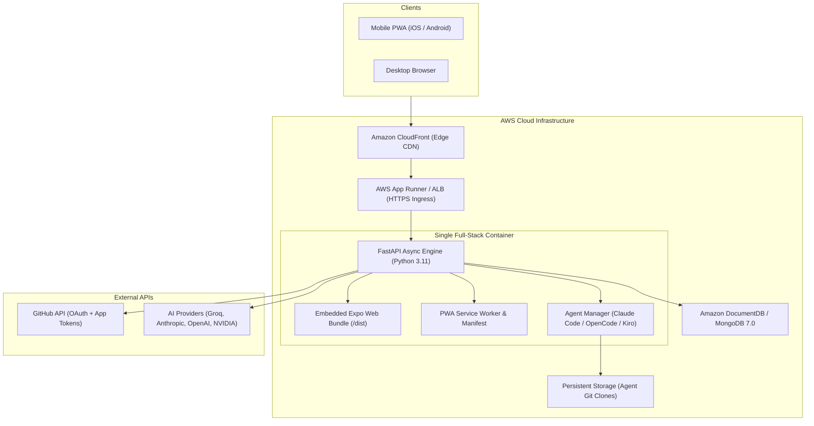

# ⚡ MergeDeck

<div align="center">

### **Reels for Pull Requests — AI-Native Code Review for the Agentic Era**

[](DOCKER.md)
[](apprunner.yaml)
[](#-progressive-web-app-pwa)
[](backend/)
[](frontend/)
[](LICENSE)

*Swipe through agent PRs, inspect reasoning trajectories, chat with multi-model AI, and fire background coding agents directly from your phone or desktop.*

[Quick Start](#-quick-start-with-docker-recommended) · [Key Features](#-key-features) · [Architecture](#-cloud-native-architecture) · [AWS Deployment](#-deploying-on-aws) · [Local Development](#-local-development)

---

</div>

## 💡 The Core Problem

> **Autonomous coding agents are writing code at scale.**
> 
> Tools like **Claude Code**, **Codex**, **Gemini**, **Kiro**, and **OpenCode** are opening PRs autonomously—over **1.2 million every month**, compounding at **14× year-over-year**.
>
> But we're still reviewing all that code on GitHub’s flat, grey walls of text designed back in 2008. **No context. No reasoning. No trajectory. Just a massive diff and a merge button.**
>
> **MergeDeck fixes that.**
>
> It’s an AI-native, mobile-first PR review platform built for the agentic era—combining a swipeable PR feed, an agent trajectory engine (What → Why → How), inline AI chat, one-tap approve/reject/merge, and the ability to **FIRE new background agents** directly from the review interface to bring them back into a structured human loop.

---

## ✨ Key Features

### 📱 1. Reel-Style Swipeable PR Feed
* **Card Deck Experience**: Every pull request is formatted as a self-contained, high-signal reel card. Swipe vertically through PRs in seconds with zero cognitive fatigue.
* **Risk Assessment Badges**: Color-coded badges (*Critical*, *Moderate*, *Low*) immediately communicate the safety radius of the change.
* **Semantic Categorization**: Automatically detects whether a PR is a *Bug Fix*, *Security Patch*, *Refactor*, *Performance*, or *Feature*.
* **Focused Micro-Diffs**: Highlights only the high-impact core logic (10–30 lines) with syntax highlighting, avoiding lockfile and boilerplate noise.

### 🧠 2. Agent Trajectory Engine (What → Why → How)
Autonomous agents don't just dump code—they think, research, and test. MergeDeck exposes this cognitive trajectory:
* **What**: High-level problem definition and business impact.
* **Why**: The architectural rationale and alternatives considered.
* **How**: Step-by-step tool trace, commands run, dependencies added, and unit test outputs.

### ⚡ 3. Bi-Directional Agent Orchestration ("Fire Background Agents")
Traditional review is passive. In MergeDeck, review is an **active command center**:
* Tap **Assign Agent** directly on any PR card to dispatch an autonomous background agent (**Claude Code**, **OpenCode**, or **Kiro**).
* Issue custom instructions: *"Refactor this endpoint to use AWS DynamoDB batch writes and add test coverage."*
* The agent executes inside an isolated sandbox, pushes commits back to GitHub, and updates your deck with a new trajectory card for final approval.

### 💬 4. In-Context AI Chat (`AIChatSheet`) with BYOK
* Slide up the contextual AI sheet on any PR to interrogate the code in real-time (*"Could this introduce a race condition?", "Explain line 42 in plain English"*).
* **Bring Your Own Key (BYOK)**: Connect your preferred inference provider:
  * ⚡ **Groq**: Sub-second ultra-low latency LPU inference
  * 🧠 **Anthropic Claude**: Frontier reasoning (Claude 3.5 & 3.7 Sonnet)
  * 🌐 **OpenAI**: GPT-4o and o1-mini
  * 🚀 **Mistral AI**, **NVIDIA NIM**, and **OpenRouter** (100+ models)

### 📲 5. Progressive Web App (PWA) on Mobile
* **Installable on iOS & Android**: Runs full-screen in standalone mode without browser URL bars.
* **Offline Resilience**: Custom Service Worker pre-caches the app shell. If connection drops, a dedicated dark-mode offline screen buffers user state and automatically reconnects when the network returns.
* **Custom Brand Identity**: Dynamic glowing neon cyan and electric purple tab favicons and adaptive app icons.

### 🚀 6. 1-Tap Git Actions
* Formal GitHub Reviews: **Approve**, **Request Changes**, or **Merge** with a single tap.
* Instant synchronization with GitHub REST and GraphQL APIs.

---

## 🏛️ Cloud-Native Architecture

MergeDeck packages the pre-compiled **Expo React Native Web UI** and the async **Python FastAPI backend** into a single, high-performance OCI production container.



---

## ⚡ Quick Start with Docker (Recommended)

MergeDeck runs out-of-the-box using Docker Compose.

### 1. Clone the Repository
```bash
git clone https://github.com/CodeNova-Ayush/AWS-Project.git
cd AWS-Project
```

### 2. Configure Environment Secrets
Copy the template and fill in your keys (at minimum, your GitHub OAuth credentials):
```bash
cp .env.example .env
```

Example `.env`:
```env
# Database
MONGO_URL=mongodb://mongo:27017/codetok
DB_NAME=codetok

# Server
PORT=8000
PYTHONUNBUFFERED=1
SKIP_CLI_INSTALL=true

# GitHub OAuth
GITHUB_OAUTH_CLIENT_ID=your_client_id
GITHUB_OAUTH_CLIENT_SECRET=your_client_secret
GITHUB_REDIRECT_URI=http://localhost:8000/auth-callback

# AI Provider Keys (Optional: can also be set in Profile > BYOK)
OPENAI_API_KEY=
ANTHROPIC_API_KEY=
GROQ_API_KEY=
```

### 3. Build and Launch
```bash
docker compose up --build -d
```

Open **`http://localhost:8000`** in your browser!

```bash
# View live application logs
docker compose logs -f app

# Stop services
docker compose down
```

---

## 🌐 Hosting on Local Wi-Fi (Mobile Testing)

Because MergeDeck binds to `0.0.0.0:8000`, any device on your local Wi-Fi can access and install it:

1. Find your machine's local IP:
   ```bash
   ipconfig getifaddr en0   # macOS
   hostname -I              # Linux
   ```
2. On your phone (connected to the same Wi-Fi), navigate to:
   ```
   http://<YOUR_LOCAL_IP>:8000
   ```
3. **Install as PWA**:
   * **iOS Safari**: Tap **Share** ($\boxuparrow$) → **"Add to Home Screen"**.
   * **Android Chrome**: Tap **Menu** (`⋮`) → **"Add to Home screen"** / **"Install app"**.

---

## ☁️ Deploying on AWS

### Option 1: AWS App Runner (Fastest — ~3 Minutes)
MergeDeck includes an [`apprunner.yaml`](apprunner.yaml) for automated container builds:
1. Push your repository to GitHub or push the container to **Amazon ECR**.
2. In the **AWS App Runner Console**:
   * Source: **Source code repository** or **Container registry**
   * Port: `8000`
   * Add your environment variables in the App Runner dashboard.
   * Click **Create & Deploy** $\rightarrow$ AWS gives you a live HTTPS domain in ~3 minutes.

### Option 2: AWS EC2 / ECS Fargate
```bash
# On an EC2 instance with Docker installed:
git clone https://github.com/CodeNova-Ayush/AWS-Project.git
cd AWS-Project
docker compose up --build -d
```

---

## 💻 Local Development

If you prefer developing without Docker:

### 1. Backend (FastAPI + Python 3.11)
```bash
cd backend
python3 -m venv venv
source venv/bin/activate
pip install -r requirements.txt
cp .env.example .env

# Run development server
python main.py
# Backend runs on http://localhost:8000 (Docs: http://localhost:8000/docs)
```

### 2. Frontend (Expo / React Native Web)
```bash
cd frontend
npm install --legacy-peer-deps

# Start Expo Web dev server
npm run web
# Frontend runs on http://localhost:8081
```

---

## 📁 Repository Structure

```
AWS-Project/
├── Dockerfile                  # Multi-stage production container (Expo + FastAPI)
├── docker-compose.yml          # Local multi-container orchestration (App + MongoDB)
├── apprunner.yaml              # AWS App Runner deployment configuration
├── AWS_BLOG.md                 # Complete AWS Architecture & Developer blog post
├── backend/
│   ├── app/
│   │   ├── api/v1/             # API routes (issues, prs, auth, chat, keys)
│   │   ├── core/               # App config, MongoDB connection, security
│   │   ├── domain/             # Pydantic data schemas
│   │   ├── integrations/       # GitHub API & GitHub App JWT authentication
│   │   └── main.py             # FastAPI factory, PWA routes & static bundle mount
│   ├── agent_manager.py        # Subprocess runner for background agents
│   └── requirements.txt        # Python backend dependencies
└── frontend/
    ├── app/
    │   ├── +html.tsx           # Root HTML template with PWA tags & Service Worker
    │   ├── (tabs)/             # Tab navigation (feed, profile, sessions)
    │   ├── _layout.tsx         # Root layout with global PWA install banner
    │   └── index.tsx           # Main landing / login screen
    ├── public/
    │   ├── manifest.json       # W3C Web App Manifest
    │   ├── sw.js               # Offline caching Service Worker
    │   ├── offline.html        # Dark-mode offline fallback screen
    │   ├── favicon.ico         # Multi-size tab favicon
    │   └── icons/              # PWA icons (192, 512, maskable, apple-touch)
    └── src/
        ├── components/         # Card deck, diff viewer, agent trajectory, chat
        ├── constants/          # Theme constants & types
        └── services/           # API client & local storage
```

---

## 📄 License

This project is licensed under the [MIT License](LICENSE).
